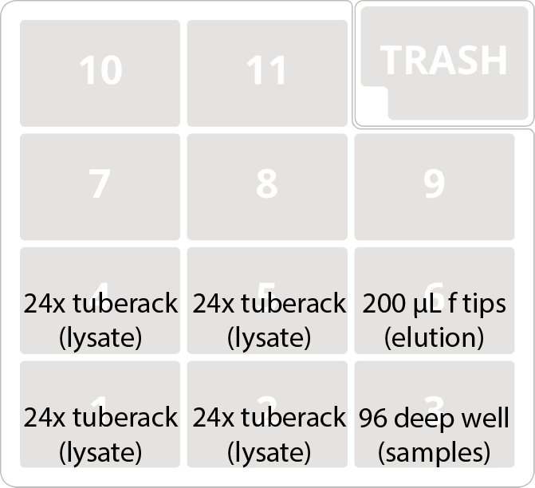
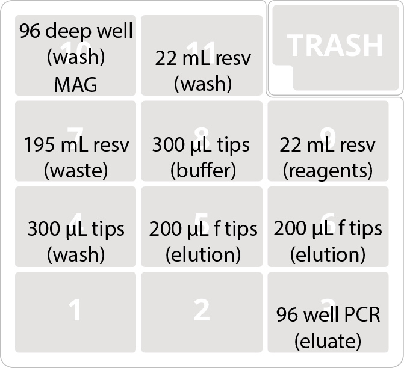

# Zymo QuickDNA Fecal/Soil DNA Extraction

This protocol automates the hybrid tube/plate version of the [Zymo QuickDNA extraction kit (P/N D6012-FM)](https://www.zymoresearch.com/collections/quick-dna-fecal-soil-microbe-kits/products/quick-dna-fecal-soil-microbe-96-magbead-kit). We prefer this version, as it allows sample homogenization using standard tube-based beadbeaters with a lower risk of well-to-well contamination, something [we commonly observed in plate-based homogenization](https://msystems.asm.org/content/4/4/e00186-19.abstract).

The protocol is divided into two parts: Part A condenses the homogenates from tube to plate format, and Part B performs the DNA isolation using magnetic beads. 

# Part A

## Buffers and Reagents

None.

## Equipment
### OpenTrons equipment

- OT-2 robot
- Single channel P300 pipette
- 4x OpenTrons 24-place tube racks

## Consumables

- 1x Opentrons 200 µL filtertips

## Setup

### Deck layout

## Protocol

Beadbeat samples as directed in the protocol, then centrifuge for 5 minutes at 10,000 *x*g.

Place uncapped tubes into the four 24-place OpenTrons tube racks. They will be transferred to the deep-well plate in the same orientation presented on the deck. In other words, samples from deck slot 4 will end up in the top-left quadrant of the plate, samples from deck slot 5 will end up in the bottom-right quadrant, and so on. 

# Part B

## Buffers and Reagents

### MagBinding Buffer + beads
To save a deck slot, we pre-mix beads and buffer for the initial binding step. We need a total of 72 mL per extraction plate:

- 2.9 mL beads
- 69.1 mL MagBinding Buffer

### MagBinding Buffer

57 mL per plate.

### MagWash 1

57 mL per plate.

### MagWash 2

189 mL per plate.

### Elution Buffer

6 mL per plate.

## Equipment
### OpenTrons equipment

- OT-2 robot
- 8-channel P300 pipette
- Magnetic module

### Other equipment

Beadbeater for 2 mL tubes.

## Consumables

- 1x VWR 96-well 1 mL u-bottom plate (output of Part A)
- 2x USA Scientific 22 mL reservoir plate
- 1x NEST 195 mL reservoir plate
- 1x BioRad 96 well 200 µL PCR plate
- 2x Opentrons 300 µL tips
- 2x Opentrons 200 µL filter tips

## Setup

### Deck layout

### Reagents

- 9: Reagents (USA Scientific 22 mL reservoir plate)
	- 1-4: MagBinding Buffer + Beads mix (18 mL/well)
	- 5-7: MagBinding Buffer (19 mL/well)
	- 8: Elution Buffer (7 mL)
- 11: Wash buffers (USA Scientific 22 mL reservoir plate)
	- 1-3: Wash Buffer 1 (19 mL/well)
	- 5-12: Wash Buffer 2 (21 mL/well)

## Protocol

Place plate of homogenate supernatants (output of Part A) onto the magdeck in position 10. Press go. 