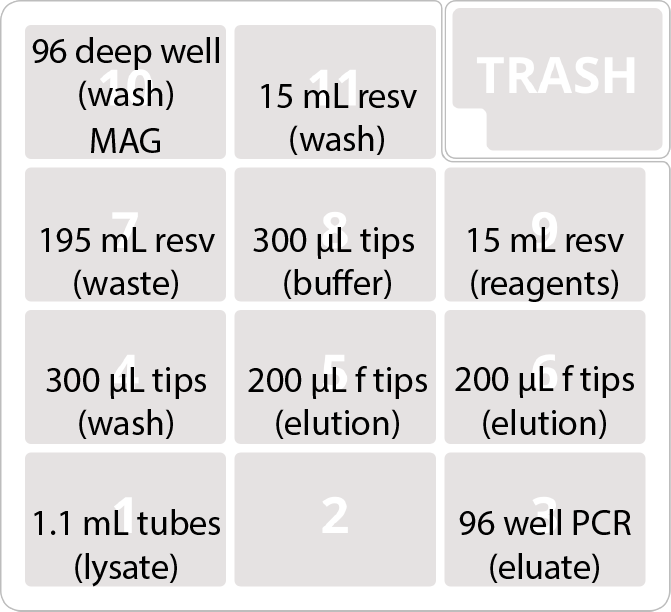

# Isolate DNA extraction

This protocol is derived from the Bio On Magnetic Beads protocol #7.1, "**BOMB gDNA extraction using GITC lysis.**" ([Oberacker et al 2019](Oberacker et al.(2019), Bio-On-Magnetic-Beads (BOMB): Open platform for high-throughput nucleic acid manipulation. PLOS Biology,17(1), https://doi.org/10.1371/journal.pbio.3000107)). It is adapted to use a bead-beating lysis step for efficient lysis of all cell types. 

Approximate total run time: 3.5 hours

## Buffers and Reagents

### Lysis buffer
This is a combination of the standard TE buffer and the lysis buffer from the original protocol, as we do not include a separate RNA isolation step. 

For 1L stock:

 - 298.5 g GITC
 - 35.3 mL Tris HCl, pH 8 (1M stock solution)
 - 12.6 g Sarkosyl
 - 26 mL EDTA (0.5M stock solution)
 - 632 µL Antifoam A

Adjust pH with HCl to 7.6-8.0. 380 µL needed per sample; 40 mL per extraction plate.
 
 
### Carboxyl-coated paramagnetic beads

The BOMB publication includes instructions for lab-made paramagnetic beads. For convenience, we use [SpeedBeads (GE45152105050250)](https://www.sigmaaldrich.com/catalog/product/sigma/ge45152105050250?lang=en&region=US) from GE Healthcare. These need to be washed and diluted prior to use.

To prepare 50 mL working stock:

- vortex mix beads
- transfer 1 mL to 1.5 mL tube
- pellet beads on magnetic rack
- wash 2X with TE buffer
- resuspend in 1 mL TE buffer
- transfer to 50 mL conical tube and add TE to 50 mL

20 µL needed per sample; 2.5 mL per extraction plate.

### Isopropanol

720 µL per sample, 75 mL per extraction plate.

### 80% Ethanol

600 µL per sample, 60 mL per extraction plate.

### Elution buffer: 5mM Tris-HCl, pH 8.5

70 µL per sample, 7 mL per extraction plate.

## Equipment
### OpenTrons equipment

- OT-2 robot
- Magnetic Module
- 8-channel P300 pipette

### Other equipment

For beadbeating, we use [0.1 mm glass beads (PN 11079101)](https://biospec.com/product/glass-beads) from BioSpec, approximately 0.4 mL (1 g) per tube. Beads are loaded with a custom-fabricated dispenser. 

We use a BeadRuptor Elite beadbeater from Omni International, fitted with a [96 strip well tube carriage (PN 19-010-330)](https://www.omni-inc.com/96-strip-well-tube-carriage.html).

## Consumables

- 1x VWR 96-well 1 mL u-bottom plate
- 1x Axygen 96-well 1.1 mL strip tube plate
- 2x USA Scientific 22 mL reservoir plate
- 1x NEST 195 mL reservoir plate
- 1x BioRad 96 well 200 µL PCR plate
- 2x Opentrons 300 µL tips
- 2x Opentrons 200 µL filter tips

Reservoir plates can be washed and reused. 

## Setup

### Deck layout

### Reagents

- 9: Reagents (USA Scientific 22 mL reservoir plate)
	- 1: Beads (3 mL)
	- 2: Elution buffer (7 mL)
- 11: Wash buffers (USA Scientific 22 mL reservoir plate)
	- 1-4: Lysis buffer (18 mL/well)
	- 5-8: Isopropanol (18 mL/well)
	- 9-12: 80% Etahnol (18 mL/well)

## Protocol

Grow up single colonies of bacterial isolates in 800 µL of an appropriate liquid medium in 96-well 1.1 mL strip tubes. Spin down and remove supernatant. Optionally, freeze pellets until extraction.

To the pellets, add ~ 400 µL 0.1 mm glass beads, using two cycles of the bead dispenser. Place uncapped tubes with beads loaded into position 1 of the OT-2 deck.

Initiate protocol. Robot will add lysis buffer to stips, then pause. Remove the plate. (You can optionally press continue here, and the robot will begin adding reagents to the deep-well plate on the magdeck in position 10.)

Cap strip tubes, label with a marker to ensure correct orientation and order, and beat on the BeadRuptor Elite for 2 cycles of 30 seconds at 6 m/s. 

After shaking, ensure the plate with samples and beads has an equivalent balance, then centrifuge for 5 minutes at 3,500 x*g*.

Uncap strips, place back in position 1 of the OT-2 deck, and press continue. 

The remainder of the protocol is hands-off. 