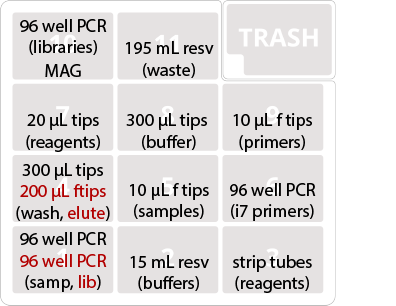

# Hackflex Library Prep

This protocol is adapted from the preprint, "**Hackflex: low cost Illumina sequencing library construction for high sample counts**" ([Gaio et al 2019](https://www.biorxiv.org/content/10.1101/779215v1.abstract)). It employs a diluted tagmentation beads and lab-made reagents to dramatically reduce the cost of Nextera Flex Illumina libraries. This version is adapted for the OpenTrons robot based on our testing.

Approximate total run time: ???

## Buffers and Reagents

### Diluted BLT beads

Dilute BLT beads from kit 1:40 in molecular-grade water
 
 
### 2X tagmentation buffer

- 20 mM Tris (pH 7.6)
- 20 mM MgCl
- 50% (v/v) Dimethylformamide (DMF)

### Tagmentation stop buffer (TSB)

-  0.2% sodium dodecyl sulphate (SDS)

### Tagmentation wash buffer (TWB)

- 10% polyethylene glycol (PEG) 8000, filter sterilized
- 0.25 M NaCl
- Tris-EDTA buffer (TE);  10 mM Tris,  1 mM EDTA

### PCR master mix
per reaction:

- 10 ul of 5x GXL buffer
- 4 ul of 25 mM dNTPs
- 2 ul of PrimeStar GXL polymerase
- 14 ul of nuclease free water.

### Nextera-compatible index primers

As written, this protocol uses a plate eacgh of unique i7 and i5
indices . Primer working stocks are at 2.5 µM.

### Paramagnetic beads for size selection

Ampure-compatible. 

### 80% Ethanol

Bead washes

### Molecular grade water (elution)

## Equipment
### OpenTrons equipment

- OT-2 robot
- Magnetic Module
- 8-channel P300 pipette
- 8-channel P10 pipette
- [Strip tube block](../../Labware/PCR_tube_block)

### Other equipment

- Thermocycler
- Vortex
- Plate centrifuge

## Consumables

- 5x VWR PCR strip tubes (89049-178)
- 1x NEST 15 mL reservoir plate
- 1x NEST 195 mL reservoir plate
- 3x BioRad 96 well 200 µL PCR plate
- 2x Opentrons 300 µL tips
- 1x Opentrons 200 µL filter tips
- 1x Opentrons 20 µL tips
- 3x Opentrons 10 µL filter tips

Reservoir plates can be washed and reused. 

## Setup

### Deck layout

### Reagents

- 2: Buffers (Nest 15 mL reservoir plate)
	- 1-2: TWB (12 mL/well)
	- 3: H2O (8 mL)
	- 4: Ampure-compatible beads (6 mL)
	- 5-7: 80% Ethanol (12 mL/well)
- 3: Reagents (VWR PCR strip tubes in tube block)
	- 1-2: TB1 (200 µL/tube)
	- 3: 1:40 diluted BLT beads (150 µL/tube)
	- 4: TSB (150 µL/tube)
	- 6-7: PCR Master Mix (200 µL/tube)

## Protocol

Set up deck as above, with DNA samples (concentration 1-100 ng/µL) in position 1 and 300 µL tips in position 4. Run protocol to set up tagmentation reaction in PCR plate on magdeck. Then remove, seal plate, and run TAG protocol on thermocycler:

**TAG protocol**

- lid @ 100 °C
- incubate @ 55 °C 15 min
- hold @ 10 °C

Centrifuge plate, then unseal and place back on magblock. Robot will add Tagmentation Stop Buffer to stop reaction. At prompt, remove plate, seal, and run PTC protocol on thermocycler:

**PTC protocol**

- incubate @ 37 °C 15 min
- hold @ 10 °C

Centrifuge plate, then unseal and place back on magblock. Robot will wash beads and add PCR master mix for library amplification. At prompt, unseal the i5 and i7 primer plates for the primer addition.

***Make a note of the i5 primer rotation number for the protocol.*** Every time the protocol is executed, it will rotate the assignment of i5 columns to samples. This will allow libraries from up to 12 sequential plates to be pooled without worry of barcode overlap. For reference, a file recording the timestamp and i5 column rotation position is saved to the robot.

At prompt, remove plate, seal, and run BLT program on thermocycler (cycle number can be adjusted for your application if necessary):

**BLT protocol**

- 3 min at 68C
- 3 min at 98C
- 12 cycles of:
	- 45 sec at 98C
	- 30 sec at 62C
	- 2 min at 68C
- 1 min at 68C
- hold at 10C

Centrifuge plate, unseal, and place back on magblock.

Remove sample plate from Position 1 and replace with a new, clean BioRad PCR plate in same position. Robot will perform a large-cut size selection on the magblock, binding fragments above the desired size and transferring the small and medium fragments to the new plate. Higher PEG concentrations in the new plate will cause the medium fragments to bind to the beads.

At prompt, remove and discard plate from magblock, then move the plate in position 1 to the magblock. Put a new, clean PCR plate in position 1. This will be your final library plate.

Robot will wash and dry beads. At prompt, replace the empty tip box in position 4 with a new box of 200 µL filter tips. Robot will use these to elute DNA and transfer to the clean plate in position 1. 