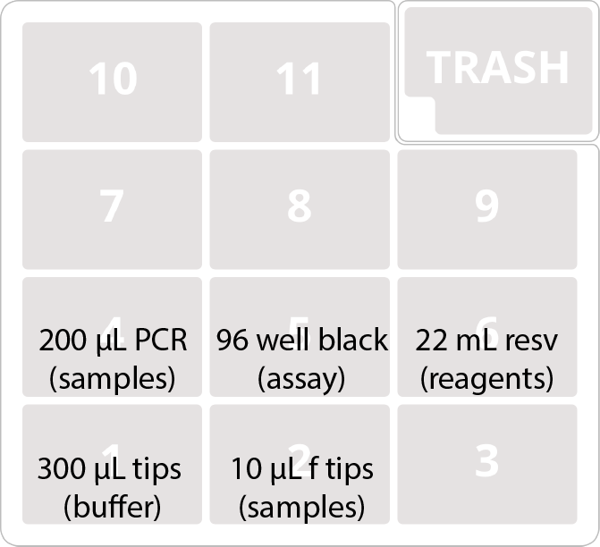
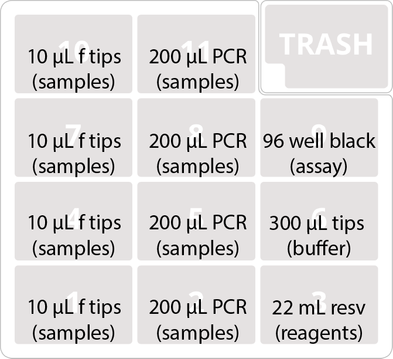

# QuantifFluor DNA quantification

This protocol efficiently transfer 2 µL of sample from a PCR plate to a flat-well plate for fluorometric quantification using a plate reader. 

There are two versions of this protocol: `Quantifluor_DNA_one-plate.py` prepares a single 96-well sample plate in 200 µL of working solution in a 96-well read plate; while `Quantifluor_DNA_four-plates.py` transfers 2 µL of sample into 40 µL of working solution in a 384-well plate. The latter version has a narrow dynamic range, but can be used to increase throughput and decrease cost.

It should be relatively agnostic to the particular kit used, so should be compatible with PicoGreen or other similar reagents.

Approximate total run time: 30 minutes.

## Buffers and Reagents

### Working solution 
This is the standard working solution from the kit, a 1:400 dilution of dye in TE buffer. 26 mL are needed for either protocol. 
 

## Equipment
### OpenTrons equipment

- OT-2 robot
- 8-channel P300 pipette
- 8-channel P10/20 pipette

### Other equipment

Fluorometric plate reader

## Consumables

- 1x Corning flat-bottom well plate, black
	- 96-well, single-plate protocol
	- 384-well, four-plate protocol
- BioRad 96 well 200 µL PCR plate(s) (with samples)
- 1x USA Scientific 22 mL reservoir plate
- 1x Opentrons 300 µL tips
- 1x or 4x Opentrons 10/20 µL filter tips

Reservoir plates can be washed and reused. 

## Setup

### Deck layout

#### Single-plate version:

#### Four-plate version:

### Reagents

- Reagents (USA Scientific 22 mL reservoir plate)
	- 1-2: Working Reagent (13 mL)

## Protocol

Load deck as shown, push go.